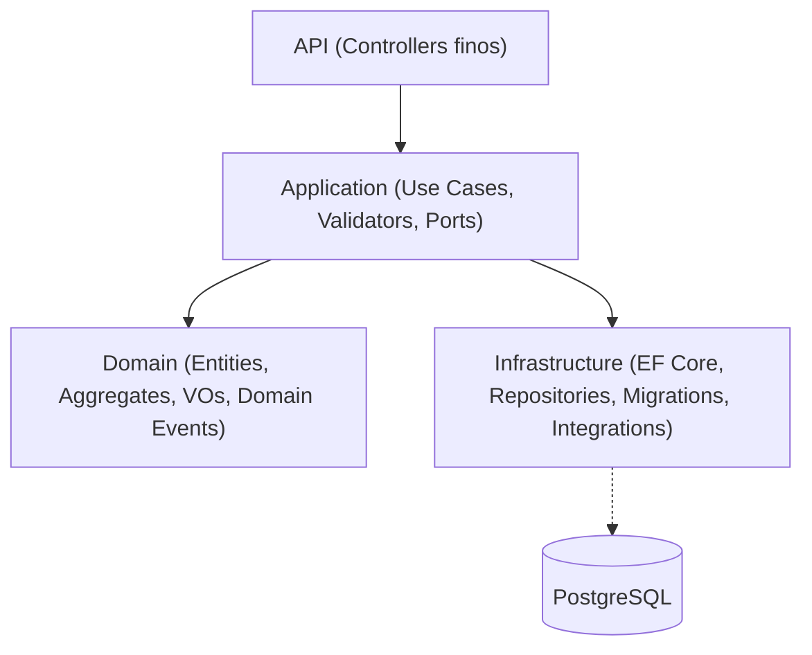

# BaitaHora

> **Sistema de agendamento para empresas de serviços, com foco em arquitetura limpa e escalabilidade**


---

## 📖 Descrição

### 💡 O que é o projeto?
O **BaitaHora** é um sistema de **agendamento e gestão para empresas de serviços**, desenvolvido em **.NET 8 + PostgreSQL**.  
Permite organizar a operação diária: cadastro de clientes, gestão de funcionários, definição de serviços, controle de agenda e marcação de atendimentos.

### 🛠️ Qual problema resolve?
Empresas de serviços (salões, barbearias, clínicas etc.) sofrem para manter a agenda organizada, evitar conflitos e controlar permissões.  
O BaitaHora entrega uma **API robusta** para centralizar essas operações, garantindo:

- 📅 Agenda organizada  
- ⏱️ Prevenção de conflitos de horário  
- 🔐 Permissões por papéis (Owner, Manager, Staff, Viewer)  
- ⚡ Base sólida para integrações (apps, chatbots, front-ends)

### 🎯 Objetivo do desenvolvimento
Prática avançada de **arquitetura backend**, aplicando:

- 🏛️ **Clean Architecture** (separação de camadas)
- 📦 **DDD** (Value Objects como CPF, RG, Email, Phone, Address)
- 🔄 **CQRS + Use Cases / Interactors**
- 📨 **MediatR + Pipeline Behaviors** (validação, autorização, logging, UoW)
- 📢 **Domain Events + Outbox Pattern**
- 🚀 Boas práticas para escalar funcionalidades
---

## 🏛️ Arquitetura

Segue **Clean Architecture**: regra de negócio isolada de banco, UI e frameworks.

### 🔹 Camadas
- **Domain** – entidades, agregados, VOs, eventos de domínio  
- **Application** – casos de uso, validações, portas (interfaces)  
- **Infrastructure** – EF Core, repositórios, migrations, integrações  
- **API** – endpoints REST finos chamando casos de uso

### 🔹 Padrões
- **CQRS**
- **Use Cases / Interactors**
- **MediatR**
- **Pipeline Behaviors**: validação, autorização, logging, Unit of Work

### 🔹 Diagrama simples



## ⚙️ Funcionalidades

Lista das principais funcionalidades já implementadas e em andamento no **BaitaHora**:

### 🔐 Autenticação & Autorização
- ✔️ Login e registro de usuários com **JWT + Cookies**  
- ✔️ Permissões baseadas em **roles** (Owner, Manager, Staff, Viewer)  
- ✔️ Máscara de permissões por empresa (**CompanyPermission bitmask**)  
- ✔️ Interceptores de autorização no pipeline (**AuthorizationBehavior**)  
---

### 🏢 Gestão de Empresas & Usuários
- ✔️ Cadastro de **empresa e dono (Owner)** no mesmo fluxo  
- ✔️ Registro de **funcionários (Employees)** vinculados a uma empresa  
- ✔️ Criação e gerenciamento de **cargos (CompanyPosition)** com permissões associadas  
- ✔️ **Promoção e mudança de cargos** de funcionários  
- ✔️ Perfil de usuário com dados pessoais e validações de **Value Objects** (CPF, RG, Email, Telefone, Endereço)  
- ✔️ Edição completa de perfis (dados do usuário, endereço, telefone, etc.)  
- ✔️ Cadastro e gerenciamento de **serviços oferecidos (ServiceOfferings)** pela empresa  
---

### 📅 Agendamentos
- ✔️ Registro de **agenda (Schedule)** para cada funcionário  
- ✔️ Criação de **appointments** vinculando cliente → serviço → funcionário → horário  
- ✔️ Prevenção de conflitos de horário para o mesmo cliente/profissional  
- ✔️ **Reagendamento** de compromissos  
- ✔️ **Confirmação de conclusão** do atendimento  
- ✔️ **Cancelamento** de compromissos  
- ❌ Chatbot de agendamento automático (planejado)  
---

### 🛠️ Arquitetura & Infraestrutura
- ✔️ **Clean Architecture** com separação Domain / Application / Infrastructure / API  
- ✔️ **CQRS + Use Cases/Interactors**  
- ✔️ **MediatR + Pipeline Behaviors** (validação, autorização, logging, Unit of Work)  
- ✔️ **Domain Events** e suporte a **Outbox Pattern** para integrações  
- ✔️ Integração com **PostgreSQL (EF Core 9 + Migrations)**  
- ✔️ Integração com mensageria externa (Kafka/RabbitMQ)  
---

## 📊 Futuro / Roadmap

### ✅ Concluído
- ✔️ Autenticação e autorização com **JWT + Cookies**
- ✔️ Máscara de permissões por empresa (**CompanyPermission bitmask**)
- ✔️ CRUD completo de **Companies, Positions, Services e Members**
- ✔️ Agendamento de clientes (Schedule + Appointment)
- ✔️ Integração de **Domain Events + Outbox Pattern**
- ✔️ Testes de unidade com **xUnit**
- ✔️ Estrutura em **Clean Architecture + CQRS + DDD**

### 🚧 Em andamento
- ⏳ Padronização dos endpoints **GET (listagem e detalhes)** para todas as entidades principais  
- ⏳ Documentação de endpoints com **Swagger**
  
### 🔮 Futuro
- ❌ Integração com **WhatsApp/Chatbot** para agendamentos automáticos
- ❌ **Dashboard web** para controle de agendas (**Angular**)
- ❌ **Aplicativo mobile** para clientes (**Angular + Ionic**)
---

## 🧰 Tecnologias

Principais tecnologias, frameworks e bibliotecas utilizadas no **BaitaHora**:

- 💻 **Linguagem & Framework**
  - [C#](https://learn.microsoft.com/dotnet/csharp/) / [.NET 8](https://dotnet.microsoft.com/)  

- 🗄️ **Banco de Dados & ORM**
  - [Entity Framework Core 8](https://learn.microsoft.com/ef/core/)  
  - [PostgreSQL 15](https://www.postgresql.org/)  

- 📦 **Arquitetura & Padrões**
  - **Clean Architecture**  
  - **CQRS** (Command Query Responsibility Segregation)  
  - **DDD** (Domain-Driven Design)  
  - **Use Cases / Interactors**  

- ⚙️ **Bibliotecas & Ferramentas**
  - [MediatR](https://github.com/jbogard/MediatR) → pipeline de requisições  
  - [FluentValidation](https://fluentvalidation.net/) → validações  
  - **Pipeline Behaviors** → validação, autorização, logging, Unit of Work  
  - **JWT Authentication** → autenticação e autorização baseada em tokens  
  - **Outbox Pattern** → consistência eventual e integração com mensageria  

- 🔧 **Infraestrutura**
  - **EF Core Migrations** → versionamento do banco de dados  
  - **Docker** (planejado) → containerização futura da aplicação

## 🔧 Instalação / Como rodar

### ✅ Pré-requisitos
- [.NET SDK 8.0.x](https://dotnet.microsoft.com/download)
- [PostgreSQL 15+](https://www.postgresql.org/) (local **ou** via Docker)
- EF Core Tools (CLI): `dotnet tool install --global dotnet-ef`

---

### 1) Clonar o repositório

```bash
git clone https://github.com/leo-leite-dev/Projeto-BaitaHora-Back.git
cd Projeto-BaitaHora-Back/src
```

---

## 🧪 Fluxo principal (exemplo ponta-a-ponta)

> **Objetivo:** sair do zero até **criar um agendamento** válido  
> *(Owner/Empresa → Serviço → Cargo → Funcionário → Cliente → Appointment)*  

> **Observação:** Os endpoints abaixo assumem que você está **autenticado** como Owner (JWT + Cookie) após o login.

---

### 1) Criar Owner + Empresa

**POST** `/api/onboarding/register-owner`

```http
POST /api/onboarding/register-owner
Content-Type: application/json
```

```json
{
  "owner": {
    "userEmail": "leonardo.passos@example.com",
    "username": "leonardo.passos",
    "rawPassword": "SenhaForte@123",
    "profile": {
      "fullName": "Leonardo Passos",
      "cpf": "12345678909",
      "rg": "456789012",
      "userPhone": "51998765432",
      "birthDate": "1998-07-15",
      "address": {
        "street": "Rua dos Andradas",
        "number": "1250",
        "complement": "Apto 402",
        "neighborhood": "Centro Histórico",
        "city": "Porto Alegre",
        "state": "RS",
        "zipCode": "90020005"
      }
    }
  },
  "company": {
    "companyName": "BaitaHora Tecnologia Ltda",
    "cnpj": "19131243000197",
    "tradeName": "BaitaHora",
    "companyPhone": "5133445566",
    "companyEmail": "contato@baitahora.com.br",
    "address": {
      "street": "Av. Ipiranga",
      "number": "1234",
      "complement": "Torre A - Sala 1234",
      "neighborhood": "Partenon",
      "city": "Porto Alegre",
      "state": "RS",
      "zipCode": "90619900"
    }
  }
}
```

---

### 2) Login do Owner

**POST** `/api/auth/login`  

Autentica o **Owner** criado no passo anterior e retorna o **JWT em Cookie**, que será usado para todas as próximas requisições.  

**Campos principais:**
- **companyId** → ID da empresa criada no passo anterior.  
- **identify** → username ou e-mail do usuário.  
- **password** → senha definida no cadastro.  
- **ip** e **userAgent** → opcionais, usados para auditoria.  

```http
POST /api/auth/login
Content-Type: application/json
```

```json
{
  "companyId": "GUID_DA_EMPRESA",
  "identify": "leonardo.passos",
  "password": "SenhaForte@123",
  "ip": "127.0.0.1",
  "userAgent": "PostmanRuntime/7.39.0"
}
```

---

### 3) Cadastrar um Serviço (ServiceOffering)

**POST** `/api/companies/{companyId}/service-offerings`  

Registra um **serviço** que a empresa oferece. Esse serviço será usado mais tarde nos agendamentos (ex.: Corte de Cabelo, Manicure, Limpeza Facial).  

**Campos principais:**
- **companyId** → vai na **URL** (path parameter).  
- **serviceOfferingName** → nome do serviço oferecido.  
- **amount** → valor padrão do serviço (em número).  
- **currency** → atualmente só aceita `"BRL"`.  

```http
POST /api/companies/{companyId}/service-offerings
Content-Type: application/json
```

```json
{
  "serviceOfferingName": "Corte de Cabelo",
  "amount": 50,
  "currency": "BRL"
}
```

---

### 4) Criar um Cargo (Position) e associar Serviços

**POST** `/api/companies/{companyId}/positions`  

Define um **cargo** dentro da empresa (ex.: Barbeiro, Manicure) e associa os **serviços** que esse cargo pode executar.  

**Campos principais:**
- **companyId** → vai na **URL** (path parameter).  
- **positionName** → nome do cargo.  
- **accessLevel** → nível de acesso do cargo, conforme o enum **CompanyRole**:  
  - `1 = Owner` → papel de dono (apenas pelo fluxo de criação inicial).  
  - `2 = Manager` → gerente, pode cadastrar/gerenciar recursos da empresa.  
  - `3 = Staff` → funcionário padrão, acessa agenda e serviços.  
  - `4 = Viewer` → apenas visualiza.  
- **serviceOfferingIds** → lista de IDs de serviços que o cargo pode executar.  

```http
POST /api/companies/{companyId}/positions
Content-Type: application/json
```

```json
{
  "positionName": "Barbeiro",
  "accessLevel": 3,
  "serviceOfferingIds": [
    "GUID_DO_SERVICE_OFFERING"
  ]
}
```

---

### 5) Registrar um Funcionário (Employee)

**POST** `/api/members/{companyId}/employees`  

Cria um **funcionário** vinculado a um **cargo (Position)** da empresa.  

> **Observação:** ao registrar o funcionário, a **Schedule** dele é criada automaticamente.  

**Campos principais:**
- **companyId** → vai na **URL** (path parameter).  
- **positionId** → ID do cargo ao qual o funcionário será associado.  
- **employee.userEmail / username / rawPassword** → credenciais do novo usuário.  
- **employee.profile** → dados pessoais e endereço (validado por Value Objects).  
- **employee.profile.birthDate** → data no formato `YYYY-MM-DD`.  

```http
POST /api/members/{companyId}/employees
Content-Type: application/json
```

```json
{
  "positionId": "GUID_DO_POSITION",
  "employee": {
    "userEmail": "joao.marcos@example.com",
    "username": "joao.marcos",
    "rawPassword": "SenhaForte!2025",
    "profile": {
      "fullName": "João Marcos",
      "cpf": "59671483020",
      "rg": "123456789",
      "userPhone": "+55 51 99876-2233",
      "birthDate": "1998-03-15",
      "address": {
        "street": "Rua das Palmeiras",
        "number": "123",
        "complement": "Apto 202, Bloco B",
        "neighborhood": "Centro",
        "city": "Porto Alegre",
        "state": "RS",
        "zipCode": "90035060"
      }
    }
  }
}
```

---

### 6) Cadastrar um Cliente (Customer)

**POST** `/api/customers/{companyId}/customers`  

Registra um **cliente** que poderá ser utilizado nos agendamentos.  

**Campos principais:**
- **companyId** → vai na **URL** (path parameter).  
- **customerName** → nome completo do cliente.  
- **customerPhone** → telefone de contato do cliente.  
- **customerCpf** → CPF do cliente.  

```http
POST /api/customers/{companyId}/customers
Content-Type: application/json
```

```json
{
  "customerName": "João Carlos",
  "customerPhone": "51966665555",
  "customerCpf": "52998224725"
}
```

---

### 7) Criar um Agendamento (Appointment)

**POST** `/api/companies/{companyId}/appointments`  

Cria um **compromisso** vinculando **funcionário (member)**, **cliente (customer)** e **horário**.  

**Campos principais:**
- **companyId** → vai na **URL** (path parameter).  
- **memberId** → ID do **funcionário** que realizará o serviço (membro da empresa).  
- **customerId** → ID do **cliente** que será atendido.  
- **startsAtUtc** → data/hora de início **em UTC** (ISO 8601), ex.: `2025-09-05T15:00:00Z`.  
- **durationMinutes** → duração do atendimento **em minutos** (ex.: 30 para 30min).  

```http
POST /api/companies/{companyId}/appointments
Content-Type: application/json
```

```json
{
  "userId": "GUID_DO_USER",
  "customerId": "GUID_DO_CUSTOMER",
  "startsAtUtc": "2025-09-05T15:00:00Z",
  "durationMinutes": 30
}
```
